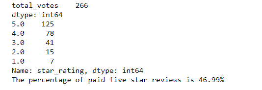

# Amazon_Vine_Analysis

## Overview of the analysis of the Vine program:

#### The purpose of this analysis is to determine if there is any bias in paid reviews over unpaid reviews for home improvement items purchased from Amazon. 

## Results:

#### Paid reviews:

#### - There were 266 total paid reviews
#### - Of the paid reviews, 125 of them had five star ratings. 
#### - The percentage of paid five star reviews is 46.99%

#### Unpaid reviews:

#### - There were 38,616 total unpaid reviews
#### - Of the unpaid reviews, 18,222 of them had five star ratings. 
#### - The percentage of unpaid five star reviews is 47.19%

## Summary:

#### Based on the results of the analysis above, there does not appear to be any bias between paid vs. unpaid reviews as the percentage of five star reviews was 47% for both the paid and unpaid review categories. 
